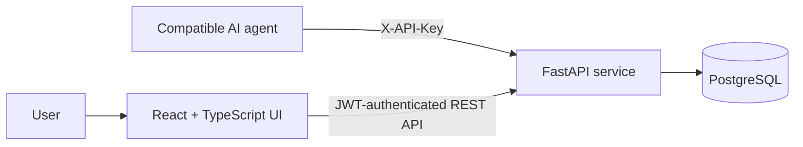

# Agent Kanban

An agent-operable project-management platform with a React Kanban interface and a FastAPI API. People can manage projects collaboratively in the web app, while compatible AI agents can work with the same projects through scoped API keys and a portable agent skill.

> Agent Kanban exposes workflows for agents; it does not bundle or host an agent runtime.

**Live app:** [agent-kanban-frontend.vercel.app](https://agent-kanban-frontend.vercel.app) · **API health:** [agent-kanban-backend.onrender.com/health](https://agent-kanban-backend.onrender.com/health)

## What it includes

- Drag-and-drop boards with backlog, to-do, in-progress, and done states
- Task priorities, assignees, ordered subtasks, and completion tracking
- Team invitations and owner/member role controls
- JWT authentication for the web app and revocable API keys for agent access
- Soft deletion, stable task ordering, validation, and structured API errors
- A portable agent skill containing safe operating guidance and an API reference

## Architecture



## Repository layout

```text
agent-kanban/
├── frontend/                 React, TypeScript, Vite, Tailwind CSS
├── backend/                  FastAPI, SQLAlchemy, Alembic
├── agent-skill/agent-kanban/ Portable instructions for compatible agents
├── .github/workflows/        Automated test, lint, and build checks
└── compose.yaml              Local full-stack environment
```

The original frontend and backend histories are preserved in this monorepo. Their component-specific setup and design notes remain in [frontend/README.md](frontend/README.md) and [backend/README.md](backend/README.md).

## Quick start with Docker

Requirements: Docker with Compose.

```bash
cp .env.example .env
docker compose up --build
```

Open the app at `http://localhost:7654`, the API at `http://localhost:7655`, and Swagger at `http://localhost:7655/docs`. The values in `.env.example` are for local development only; replace the JWT and database secrets before deployment.

## Run locally without Docker

The backend requires Python 3.12, `uv`, and PostgreSQL:

```bash
cd backend
cp .env.example .env
uv sync
uv run alembic upgrade head
uv run uvicorn app.main:app --reload --port 7655
```

In another terminal, use Node.js 22 and `pnpm`:

```bash
cd frontend
cp .env.example .env
pnpm install
pnpm dev
```

## Quality checks

```bash
cd backend && uv run ruff check . && uv run pytest
cd frontend && pnpm lint && pnpm test && pnpm build
```

## Connect an AI agent

1. Register or sign in to Agent Kanban.
2. Create an API key under **Settings → API Keys**. The full key is shown only once.
3. Install or reference [`agent-skill/agent-kanban`](agent-skill/agent-kanban).
4. Give the agent the API URL and key through its secret-management mechanism. Never commit the key.

The skill works with clients that support the Agent Skills format, including local skill directories used by Codex and Claude Code.

## Deployment

The frontend and backend are independently deployable from their subdirectories. Configure the deployment platform with `frontend/` or `backend/` as its root directory and follow the component README. The current public deployment uses Vercel for the frontend and Render for the backend.

## License

[MIT](LICENSE)
